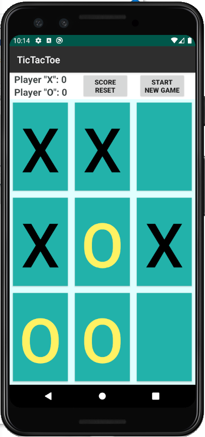
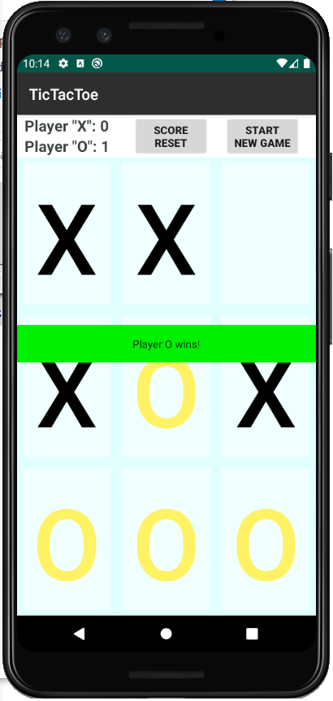

# Android Tic Tac Toe app written in Java #

## Specs:
- Players: 2 (Player "X" and "O")
- Board size: 3x3 
- Draws logic: implemented
- Poistion validator: implemented
- Round Count: implemented
- AI: none at this point (will be added in the future release)

